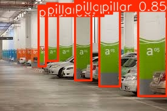

# 🚀 YOLOv8 Object Detection with Streamlit

This project uses **YOLOv8** for real-time object detection of **pillars** in images, deployed through a **Streamlit** web app. Users can upload images, see detected pillars with bounding boxes, and download processed images and their coordinates.

## 📋 Project Overview

- **YOLOv8 Model**: Trained to detect pillars in images.
- **Streamlit App**: 
  - Users can upload images for detection.
  - View original and processed images with bounding boxes.
  - Download the processed image and detected coordinates in Excel format.

## 🚀 Getting Started

1. **Install Dependencies**:
   ```bash
   pip install streamlit opencv-python numpy ultralytics Pillow pandas
   
2. **Run Streamlit App**:
  streamlit run new_yolo.py

3. **Use the App**:
  Upload an image containing pillars.
  The app detects the pillars and displays both the original and processed images with bounding boxes.
  Download the processed image and the coordinates of the detected pillars in Excel format.

## 🧠 YOLOv8 in Action
  Image Upload: Upload an image that contains pillars.
  Detection: YOLOv8 detects the pillars and draws bounding boxes around them.
  Results: The processed image is shown with bounding boxes, and the coordinates of the detected pillars are displayed below the image.
  Download Options:
  Download the processed image with bounding boxes.
  Download the coordinates of the detected pillars in an Excel file.


